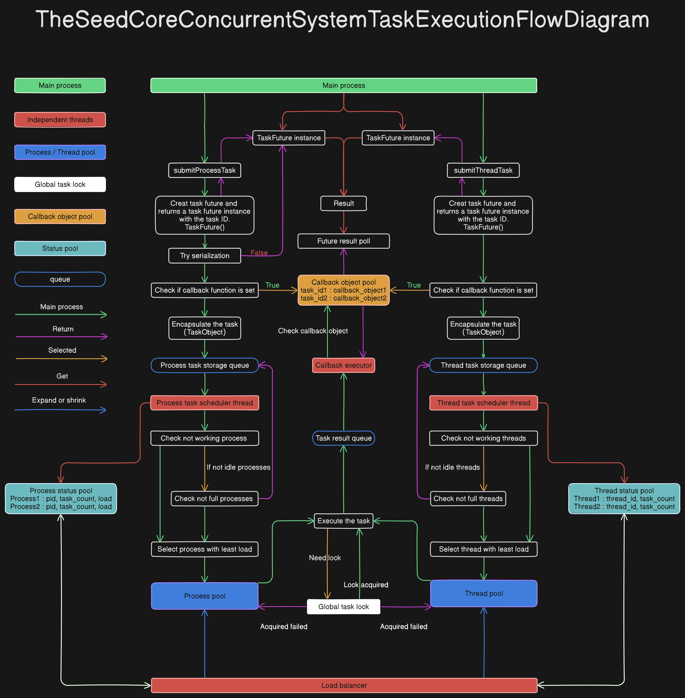

# TheSeedCoreConcurrentSystem 高性能并发框架

## 简介

**TheSeedCoreConcurrentSystem** 是一个高性能、可扩展的并发框架，专为需要高吞吐量和低延迟的应用场景设计。该模块提供了灵活且强大的并发体系结构，支持异步任务执行、GPU 加速、智能进程池和线程池管理，以及高级的任务调度和资源优化策略。

通过动态资源管理和高级任务调度，TheSeedCoreConcurrentSystem 能够根据系统负载和任务需求自动调整进程和线程的数量，实现资源的高效利用和灵活扩展。该模块还支持任务优先级、锁机制、超时控制和重试策略，确保关键任务得到及时处理。

## 主要功能和特性

- **动态资源管理**：自动调整进程和线程数量，优化资源利用率。
- **多平台兼容**：全面支持 Linux、Windows 和 macOS 操作系统。
- **GPU 加速支持**：集成 PyTorch，可利用 GPU 加速计算密集型任务。
- **高级任务调度**：支持任务优先级、锁机制、超时控制和重试策略。
- **异步回调机制**：提供基于 Qt 事件循环和核心异步事件循环的回调执行器。
- **配置灵活**：丰富的配置选项，允许自定义系统行为。
- **健壮性和容错性**：内置异常处理和资源清理机制，确保系统稳定性。

## 系统架构

### 组件概览

1. **依赖检查器** (`_checkDependencies`)
2. **系统监控器** (`_LinuxMonitor`、`_WindowsMonitor`、`_MacOSMonitor`)
3. **配置管理器** (`_ConfigManager`)
4. **同步管理器** (`_SynchronizationManager`)
5. **任务对象** (`_TaskObject`)
6. **进程和线程对象** (`_ProcessObject`、`_ThreadObject`)
7. **负载均衡器** (`_LoadBalancer`)
8. **任务调度器** (`_ProcessTaskScheduler`、`_ThreadTaskScheduler`)
9. **回调执行器** (`_QtCallbackExecutor`、`_CoreCallbackExecutor`)
10. **任务未来对象** (`TaskFuture`)
11. **并发系统核心** (`ConcurrentSystem`)
12. **系统连接器** (`ConnectConcurrentSystem`)

### 系统工作流程

1. **系统初始化**：通过 `ConnectConcurrentSystem` 函数初始化系统，创建配置管理器和同步管理器，实例化并发系统核心组件。
2. **任务提交**：用户使用 `submitProcessTask` 或 `submitThreadTask` 提交任务，任务被封装为 `_TaskObject` 对象。
3. **任务调度**：任务调度器根据任务优先级和系统负载，将任务分配给合适的进程或线程对象执行。
4. **任务执行**：进程或线程对象执行任务，并将结果反馈到同步管理器。
5. **结果处理**：回调执行器获取任务结果，执行回调函数，任务未来对象 `TaskFuture` 提供获取结果的接口。
6. **负载管理**：负载均衡器监控系统负载，动态调整进程和线程的数量。
7. **系统关闭**：调用 `closeSystem` 方法，安全地关闭系统并释放资源。

## 注意事项

- **ConnectConcurrentSystem**：系统初始化方法，必须在 `if __name__ == "__main__"` 中调用。
- **Qt模式**：如果需要兼容Qt，请务必安装 `qasync` 库并且在实例 `QtWidgets.QApplication` 后再调用 `ConnectConcurrentSystem`。
- **主事件循环**：调用 `ConnectConcurrentSystem` 后，系统会自动创建事件循环，你可以在主进程中调用 `ConcurrentSystem.MainEventLoop` 来操作主事件循环。
- **`ConcurrentSystem.MainEventLoop`**：主事件循环等价于普通的 `asyncio.AbstractEventLoop` 对象，可以使用 `run_until_complete`、`run_forever`、`creat_task` 等方法。
- **任务可序列化**：提交的进程任务函数和参数必须是可序列化的，以确保任务能够在进程间传递。
- **GPU 加速**：若要使用 GPU 加速功能，需要确保系统安装了 PyTorch 并且有可用的 CUDA 设备。
- **资源配置**：根据实际的硬件资源（如 CPU 核心数、内存大小）调整配置参数，避免过度占用系统资源导致性能下降。
- **主进程要求**：任务提交方法必须在主进程中调用，否则会引发 `RuntimeError`。

## 环境要求

### 操作系统

1. **Linux** (已测试 Ubuntu、CentOS 等主流发行版)
2. **Windows** (Windows 10 及以上版本)
3. **macOS** (macOS 10.15 及以上版本)

### Python 版本

- Python 3.8 或更高版本：系统的某些依赖库（如 asyncio、concurrent.futures 等）需要 Python 3.8 及以上的版本支持。
- 建议使用3.11及以上版本，以获得更好的性能和稳定性。

### 可选依赖

1. **qasync**：用于在 Qt 事件循环中运行异步任务，如果需要兼容Qt，必须安装此库。
2. **PyTorch**：用于 GPU 加速计算密集型任务。

## 示例

更多示例代码和使用方式，请参阅项目中的 [QtExample](QtExample.py) 或 [Example](Example.py)文件和注释。

## 许可证

此项目使用 MIT 许可证，详情请参阅项目中的 [LICENSE](LICENSE.txt) 文件。

## 作者信息

- **作者**：疾风Kirito
- **邮箱**：1453882193@qq.com
- **版本**：1.1.0
- **发布日期**：2024-10-16

---

感谢您使用 TheSeedCoreConcurrentSystem 并发任务处理框架。如有任何问题或建议，欢迎邮箱联系。
